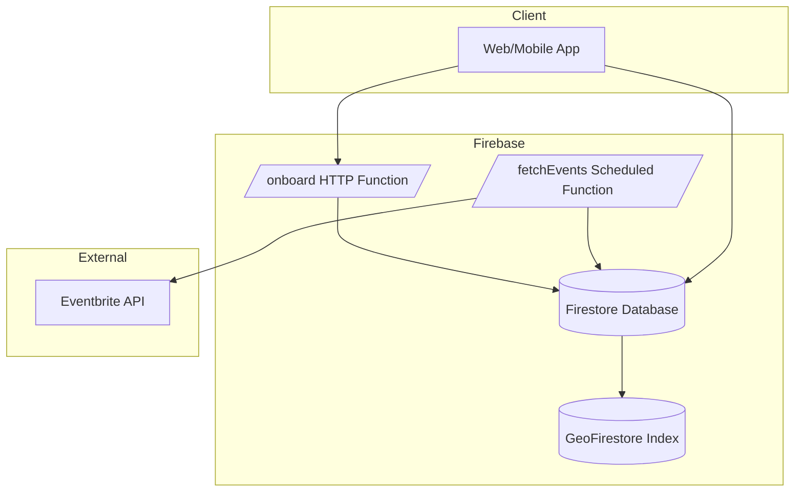

# wtm?


wtm? is a personal event discovery engine that learns your preferences via a brief onboarding questionnaire, generates a “personality” embedding, ingests events from the Eventbrite API, and then filters and ranks events near you using geospatial queries and cosine similarity. There are more features to be added but this is my overall idea in my MVP (min viable product)

---

## Table of Contents

1. [Overview](#overview)  
2. [Tech Stack & Dependencies](#tech-stack--dependencies)  
3. [Configuration & Setup](#configuration--setup)  
4. [Onboarding Flow](#onboarding-flow)  
5. [Event Ingestion Pipeline](#event-ingestion-pipeline)  
6. [Query & Ranking Flow](#query--ranking-flow)  
7. [Data Models](#data-models)  
8. [Architecture Diagram](#architecture-diagram)  
9. [API References](#api-references)  
10. [Contributing](#contributing)  
11. [License](#license)  

---

## Overview

wtw? guides users through:

1. A short questionnaire UI  
2. A decision-tree plus transformer step to compute a user “personality” vector  
3. Periodic ingestion of events via the Eventbrite API  
4. Geospatial filtering with GeoFirestore  
5. Ranking by cosine similarity between user and event embeddings  

Users receive a sorted list of nearby, highly relevant events.

---

## Tech Stack & Dependencies

| Category               | Library / SDK                                                   | Purpose                                                |
|------------------------|-----------------------------------------------------------------|--------------------------------------------------------|
| **Firebase**           | `firebase-auth`                                                 | Authentication (email/password, Google, Facebook)      |
|                        | `firebase-admin` & `google-cloud-firestore`                     | Firestore database access                              |
|                        | `firebase-functions`                                            | Cloud Functions (HTTP triggers, scheduled jobs)        |
| **Geospatial Queries** | `geofirestore`                                                  | “near” queries on Firestore                            |
| **HTTP Client**        | `axios` or `node-fetch`                                         | Calling external APIs                                  |
| **Event API**          | Eventbrite Platform API                                         | Source of events (<https://www.eventbrite.com/platform/api>) |
| **Embeddings**         | `sentence-transformers`                                         | Text → embedding vectors                               |
| **Decision Tree**      | Personality-Detection-Decision-Tree (Hardik3296)                 | Decision tree logic for profile questions              |
|                        |                                                                 | <https://github.com/Hardik3296/Personality-Detection-Decision-Tree/tree/master> |
| **Math / Rankings**    | `numpy` (Python) or native JS array ops                         | Cosine similarity calculations                         |

---

## Configuration & Setup

 - I'm keeping this empty as I work more on it

---

## Onboarding Flow

1. **Questionnaire UI (Client)**  
   - Presents a form forked from the 16 big personalities test (e.g. “What types of events do you enjoy?”)  
   - Collects basic profile info: name, age, city, optional GPS, optionally photos 

2. **Cloud Function: `/onboard` (HTTP Trigger)**  
   - Receives answers via POST JSON  
   - Runs decision tree logic from the Personality-Detection-Decision-Tree library  
   - Feeds resulting to OPEN AI api to create an embedding
   - Writes to Firestore under `users/{personality}`:

   ```jsonc
   {
     "name": "Alice",
     "location": { "city": "New York", "coords": <GeoPoint> },
     "personality_vector": [0.12, -0.34, …]
   }
   ```

---

## Event Ingestion Pipeline

1. **Cloud Function: `fetchEvents` (Scheduled / PubSub)**  
   - Every hour (or custom interval), triggers a fetch from Eventbrite:

     ```http
     GET https://www.eventbrite.com/platform/api/events/search/
       ?location.address={city}
       &categories={comma-separated}
       &start_date.range_start={ISO8601 now}
     Authorization: Bearer <EVENTBRITE_TOKEN>
     ```
   - Receives raw JSON payload

2. **Event Embedding**  
   - For each event: concatenate title + description  
   - Run through the same `sentence-transformers` model to get `event_vector`

3. **Persist to Firestore**  
   - Upsert documents in `events/{event_id}`:

   ```jsonc
   {
     "name": "Summer Music Fest",
     "location": <GeoPoint>,
     "event_vector": [0.05, 0.78, …],
     "timestamp": <Firestore Timestamp>
   }
   ```

---

## Query & Ranking Flow

When the client calls `/discover?uid={uid}`:

1. **Fetch User Profile**  
   - Retrieve `personality_vector` and `coords` from `users/{uid}`

2. **Geospatial Filter**  
   - Use GeoFirestore’s `near()` query on `events`:

   ```js
   geofirestore.collection('events')
     .near({ center: user.coords, radius: process.env.GEO_RADIUS_KM })
     .get()
   ```

3. **Cosine Similarity Ranking**  
   - For each event document:

   ```python
   import numpy as np

   def cosine_sim(a, b):
       return np.dot(a, b) / (np.linalg.norm(a) * np.linalg.norm(b))
   ```
   - Compute `score = cosine_sim(user.personality_vector, event.event_vector)`  
   - Sort events by descending `score`

4. **Response**  
   - Return top N events with `id`, `name`, `location`, `score`

---

## Data Models

### `users/{uid}`

| Field                | Type      | Description                          |
|----------------------|-----------|--------------------------------------|
| `name`               | string    | User’s display name                  |
| `location.city`      | string    | City name for initial fetch          |
| `location.coords`    | GeoPoint  | GPS coordinates (latitude/longitude) |
| `personality_vector` | number[]  | Embedding from questionnaire         |

### `events/{event_id}`

| Field            | Type      | Description                         |
|------------------|-----------|-------------------------------------|
| `name`           | string    | Event title                         |
| `location`       | GeoPoint  | Event GPS coordinates               |
| `event_vector`   | number[]  | Embedding of title + description    |
| `timestamp`      | Timestamp | Time when event was fetched/updated |

---

## Architecture Diagram



---

## API References

- **Eventbrite Platform API**  
  <https://www.eventbrite.com/platform/api>  
- **Firebase Authentication**  
  <https://firebase.google.com/docs/auth>  
- **Cloud Functions for Firebase**  
  <https://firebase.google.com/docs/functions>  
- **Cloud Firestore**  
  <https://firebase.google.com/docs/firestore>  
- **GeoFirestore**  
  <https://github.com/geofirestore/geofirestore-js>  
- **Sentence-Transformers**  
  <https://www.sbert.net/>  
- **Personality-Detection-Decision-Tree**  
  <https://github.com/Hardik3296/Personality-Detection-Decision-Tree/tree/master>  

---

## Contributing

1. Fork the repository  
2. Create a feature branch (`git checkout -b feature/YourFeature`)  
3. Commit your changes (`git commit -m "Add feature"`)  
4. Push to your branch (`git push origin feature/YourFeature`)  
5. Open a Pull Request  

Please adhere to existing code style and write tests where applicable.

---

## License

This project is licensed under the MIT License. See the [LICENSE](LICENSE) file for details.
